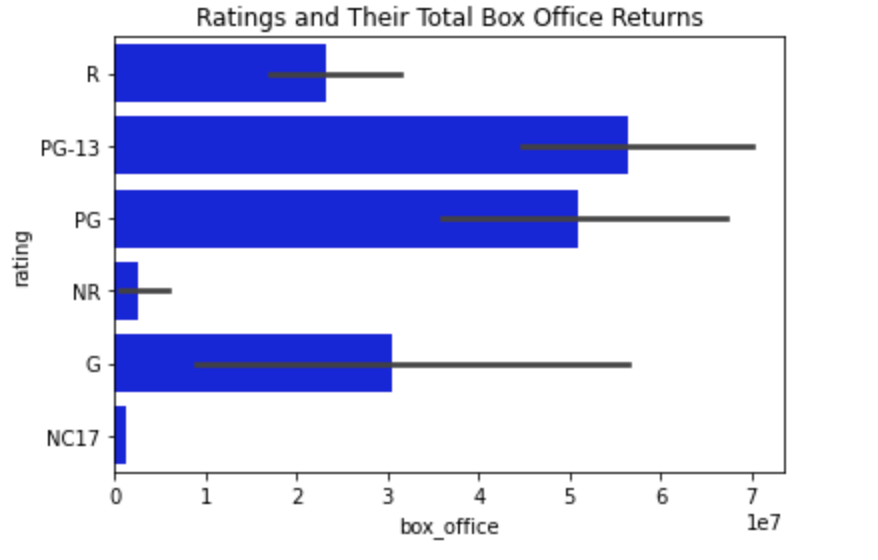

# Microsoft Movie Studios Analysis

**Authors**: Armun Shakeri

## Overview

This project analyzes current movie trends, budgets, gross income, and ratings in order to help Microsoft Studios best decide which movies to produce in its new upcoming studio. Analysis shows that if Microsoft studios produces movies that are in high demand positive gross profit will be reflected.

## Business Problem

Microsoft is seeking to enter into the movie industry and does not know what movies to create. We need to analyze what types of movies are currently trending, most popular movie genres, highest grossing movies of all time, highest budgeted movies, and movie title basics. For Microsoft's new movie studio to be profitable we need to pick a movie genre that is currently in demand and which movies had highest gross incomes, doing this ensures that the movie will have a positive inception and be profitable.

## Data

For this project we gathered information about movie income, basics, and ratings from imdb. Movie production budget information was gathered from The Numbers. In these samples we only gathered information from top grossing films to identify if there were any common themes and/or patterns between top grossing films and their respective genres. The end goal of our final data was to clean this information and provide 4 variables, production budget, domestic gross income, film ratings, and count of film genres.  


## Methods

Ahead of modeling and analyzing the data, we needed to clean the information we had presented. To do so we removed movie run times, start year, release date, and worldwide gross income, and combined all the information into one complete data set which provided the movies' title, domestic_gross, production_budget, genre, and average rating. When we began to model this data we first calculated statistical methods (mean, median, mode...etc) this helped create a general idea of where the movie industry is currently at in todays market, and was a good baseline for analysis. We then modeled this data using histograms which allowed us to clearly see which movies and/or genres were the top of what was being analyzed, such as top grossing films or production budgets. 


## Results

From the analysis above there is definetly a trend among top grossing films. Top grossing movies have more than one specific genre. These films are also family type films, this helps tremendously in attracting a large audience since it the film is targeting all ages. Top grossing films, that have a rating of above 7.0, also have production budgets of at least $100,000,000 with a mode of $200,000,000. Any more than a $300,000,000 the film will see diminishing returns with domestic profits since the average gross profit of films is $437,443,300. 

These models can definetly be generealized beyond the data presented. There is a trend between top grossing films between production budget, rating and domestic gross income. Businesses can use this data to help decide which movies to create. If Microsoft decides to follow this model it will see its first film do very well and could possible save microsoft from allocating too much to the film's production budget. 


### Visual 1


Visual 1 shows that the film industry is already saturated with action, adventure, and sci fi films. In order for Microsoft Studios to differentiate itself from its competitors they should look into producing a film that is still in high demand but also not a genre that is mass produced. 

### Visual 2



We can see from Visual 2 that action, adventure, and animation films had the highest profits among the other film genres. 


## Conclusions

The following below are three reccomendations for Microsoft Studio's first film:

1) The film should have a maximum budget of $200,000,000. The film will need to have a large budget to allocate to  hiring top actors and having up to date visual affects. 

2) The film's genre should be action, adventure, and animation. Having aspects of several genres will help the film attract a larger audience.

3) The film should be a family type of movie. Genres that contain aspects of action, adventure, and animation  are also geard more towards the family demographic, and like point #2 if the film is geared strictly for an older audience it will have a smaller target audience. Our goal is for Microsoft's first movie to to have a broad target audience.


## For More Information

Please review our full analysis in analysis.ipynb or our [presentation](./DS_Project_Presentation.pdf).

For any additional questions, please contact Armun Shakeri ashakeri62@gmail.com 

## Repository Structure

```
├── data 
├── images 
├── zippedData
├── analysis.ipynb 
├── student.ipynb
├── CONTRIBUTING.md                      
├── data.sqlite                              
├── DS_Project_Presentation.pdf         
├── LICENSE.md                         
└── README.md                             
```
